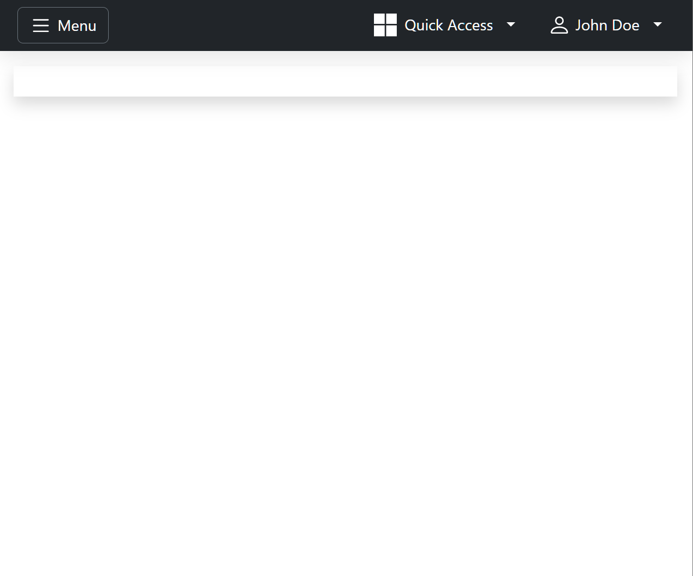
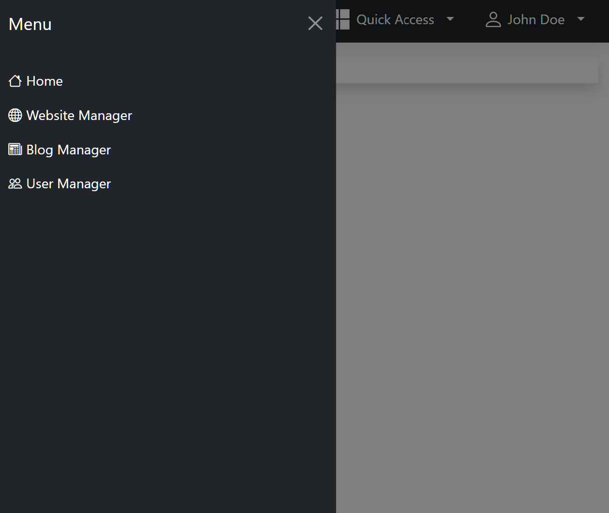
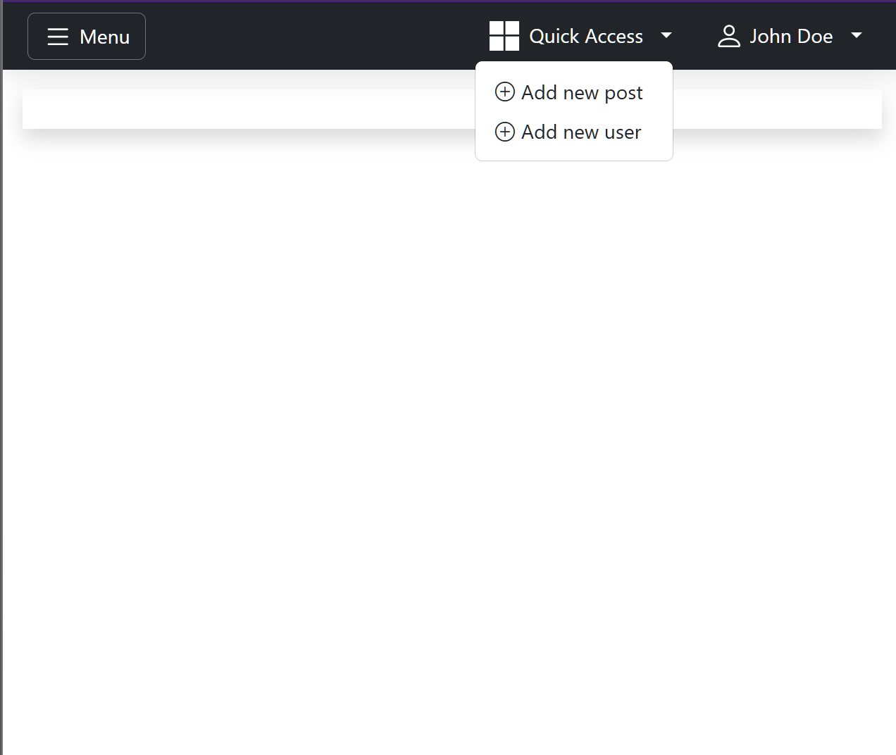
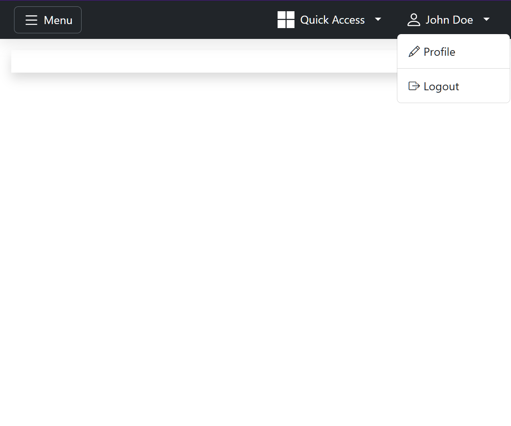

# Dashboard <a href="https://gitpod.io/#https://github.com/gouniverse/dashboard" style="float:right;"></a>

This is a project for quickly building dashboards.

- Uses the latest Bootstrap 5.3.1
- Uses the latest Bootstrap Icons
- Preset sidebar menu
- Preset user dropdown menu
- Preset quick access menu
- Preset menu switcher
- Supported all Bootswatch themes

## Example

- Adding to an HTTP handler

```golang
func dashboard(w http.ResponseWriter, r *http.Request) {
	dashboard := dashboard.NewDashboard(dashboard.Config{
		Menu: []dashboard.MenuItem{
			{
				Title: "Home",
				URL:   "/",
			},
            		{
				Title: "Logout",
				URL:   "/auth/logout",
			},
		},
	})
	html := dashboard.ToHTML()
	w.Write([]byte(html))
}
```

- Adding to layout function, to reuse on multiple places
```golang
func layout(r *http.Request, opts AdminDashboardOptions) string {
    authUser := helpers.GetAuthUser(r)

    logoImageURL = "YOUR_IMAGE_URL.png"
	logoRedirectURL = "/"

    dashboardMenu := []dashboard.MenuItem{
            {
                Title: "Home",
                URL:   links.NewAdminLinks().Home(map[string]string{}),
            },
            {
                Title: "Blog Manager",
                URL:   links.NewAdminLinks().Blog(map[string]string{}),
            },
            {
                Title: "Website Manager",
                URL:   links.NewAdminLinks().Cms(map[string]string{}),
            },
            {
                Title: "User Manager",
                URL:   links.NewAdminLinks().Users(map[string]string{}),
            },
        }

    dashboardUser := dashboard.User{
            FirstName: authUser.FirstName(),
            LastName:  authUser.LastName(),
        }

    dashboardQuickAccessMenu := []dashboard.MenuItem {
        {
            Title: "New post",
            URL: "/post-create",
        },
        {
            Title: "New page",
            URL: "/page-create",
        }
    }
        
    dashboardUserMenu := []dashboard.MenuItem {
        {
            Title: "Profile",
            URL: "/account/profile",
        },
        {
            Title: "Logout",
            URL: "/auth/logout",
        }
    }
        
    dashboard := dashboard.NewDashboard(dashboard.Config{
        HTTPRequest:                r,
        Content:                    opts.Content,
        Title:                      opts.Title,
        LogoImageURL                logoImageURL,
        LogoRedirectURL             logoRedirectURL,
        Menu:                       dashboardMenu,
        User:                       dashboardUser,
        UserMenu:                   dashboardUserMenu,
        QuickAccessMenu:            dashboardQuickAccessMenu,
        Scripts:                    opts.Scripts,
        ScriptURLs:                 opts.ScriptURLs,
        Styles:                     opts.Styles,
        StyleURLs:                  opts.StyleURLs,
        // NavbarBackgroundColorMode: "light"                   // optional, defaults to dark
        // ThemeName:                 dashboard.THEME_MINTY,    // optional, defaults to the default Bootstrap theme
        // ThemeHandlerUrl:      links.NewAdminLinks().Theme(map[string]string{"redirect": links.NewAdminLinks().Home(map[string]string{})}),   // Optional (Advanced)
        // UncdnHandlerEndpoint: links.NewAdminLinks().Uncdn(map[string]string{}),                                                              // Optional (Advanced)
    })

    return dashboard.ToHTML()
}
```

## Screenshots

- Main View



- Main Menu



- Quick Access Menu



- User Menu



## Development
For working on this package:
- Open in Gitpod (use the button provided)
- Run these commands sequentially
- Open the browser URL displayed in the terminal
```
task dev:init
task dev
```

## Noteworthy

- https://github.com/pro-dev-ph/bootstrap-simple-admin-template

- https://github.com/PlainAdmin/plain-free-bootstrap-admin-template

- https://github.com/tabler/tabler

- https://github.com/puikinsh/Adminator-admin-dashboard

- https://github.com/themesberg/volt-bootstrap-5-dashboard

- https://dribbble.com/shots/19114068-Dashboard

- https://demo.themefisher.com/focus/

## Similar Golang Projects

- https://github.com/oal/admin

- https://github.com/uadmin/uadmin

- https://github.com/GoAdminGroup/go-admin

- https://github.com/entkit/entkit
