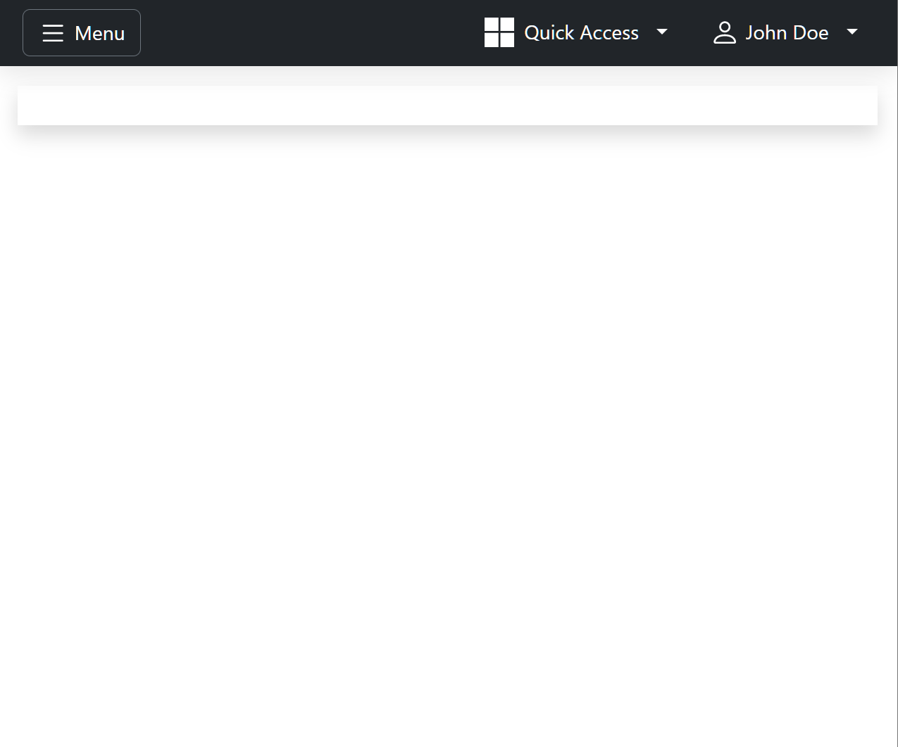
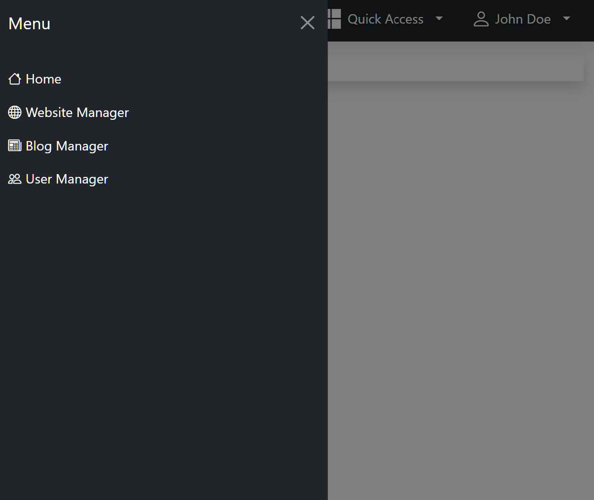
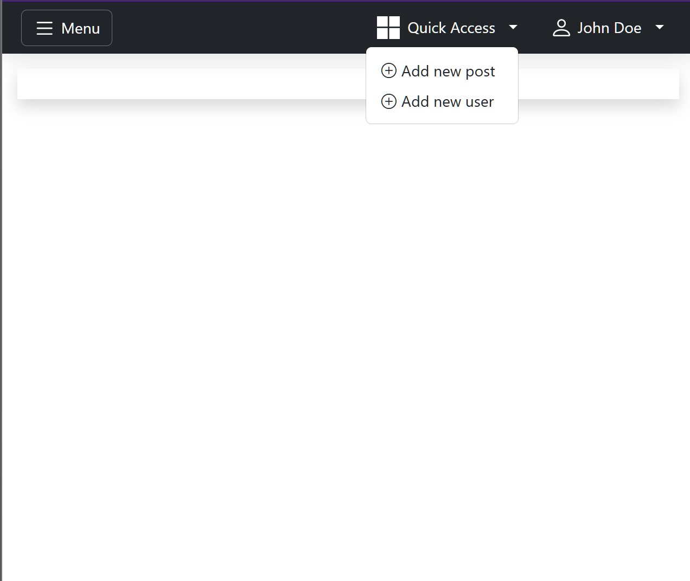
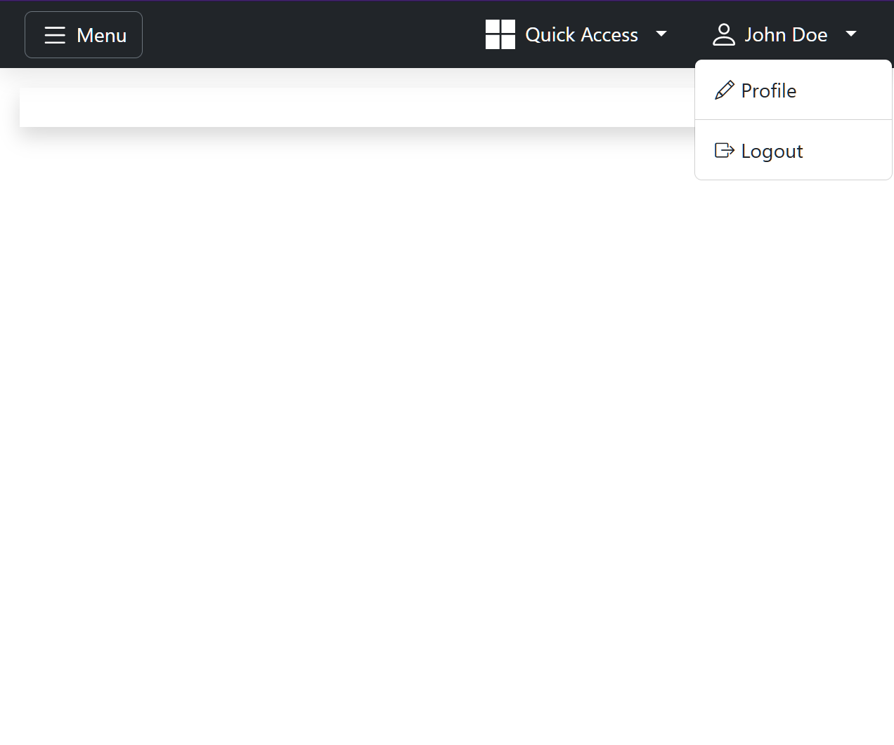

# Dashboard <a href="https://gitpod.io/#https://github.com/gouniverse/dashboard" style="float:right;"></a>


[](https://goreportcard.com/report/github.com/gouniverse/dashboard)
[](https://pkg.go.dev/github.com/gouniverse/dashboard)

This is a project for quickly building a dashboard.

Out of the box it provides a general layout, main menu,
user dropdown menu, quick access menu, and theme switcher.

The content of the page itself is left blank. It is up to the developer
to customize the pages as needed by the application he is building.

## License

This project is licensed under the GNU Affero General Public License v3.0 (AGPL-3.0). You can find a copy of the license at [https://www.gnu.org/licenses/agpl-3.0.en.html](https://www.gnu.org/licenses/agpl-3.0.txt)

For commercial use, please use my [contact page](https://lesichkov.co.uk/contact) to obtain a commercial license.

## Features

- Uses the latest [Bootstrap](https://getbootstrap.com) (v5.3.3)
- Uses the latest [Bootstrap Icons](https://icons.getbootstrap.com/) (v1.11.3)
- Preset sidebar menu
- Preset user dropdown menu
- Preset quick access menu
- Preset menu switcher
- Supported all [Bootswatch](https://bootswatch.com/) themes (26 total)

## Example

- Adding to an HTTP handler

```golang
func dashboard(w http.ResponseWriter, r *http.Request) {
	dashboard := dashboard.NewDashboard(dashboard.Config{
		Menu: []dashboard.MenuItem{
			{
				Title: "Home",
				URL:   "/",
			},
			{
				Title: "Logout",
				URL:   "/auth/logout",
			},
		},
	})

	w.Write([]byte(dashboard.ToHTML()))
}
```

- Adding to a layout function, to reuse on multiple places

```golang
func layout(r *http.Request, opts AdminDashboardOptions) string {
    authUser := helpers.GetAuthUser(r)

    logoImageURL = "YOUR_IMAGE_URL.png"
	logoRedirectURL = "/"

    dashboardMenuItems := []dashboard.MenuItem{
            {
                Title: "Home",
                URL:   links.NewAdminLinks().Home(map[string]string{}),
            },
            {
                Title: "Blog Manager",
                URL:   links.NewAdminLinks().Blog(map[string]string{}),
            },
            {
                Title: "Website Manager",
                URL:   links.NewAdminLinks().Cms(map[string]string{}),
            },
            {
                Title: "User Manager",
                URL:   links.NewAdminLinks().Users(map[string]string{}),
            },
        }

    dashboardUser := dashboard.User{
            FirstName: authUser.FirstName(),
            LastName:  authUser.LastName(),
    }

    dashboardQuickAccessMenuItems := []dashboard.MenuItem {
        {
            Title: "New post",
            URL: "/post-create",
        },
        {
            Title: "New page",
            URL: "/page-create",
        }
    }
        
    dashboardUserMenuItems := []dashboard.MenuItem {
        {
            Title: "Profile",
            URL: "/account/profile",
        },
        {
            Title: "Logout",
            URL: "/auth/logout",
        }
    }
        
    dashboard := dashboard.NewDashboard(dashboard.Config{
        HTTPRequest:                r,
        Content:                    opts.Content,
        Title:                      opts.Title,
        LogoImageURL                logoImageURL,
        LogoRedirectURL             logoRedirectURL,
        MenuItems:                  dashboardMenuItems,
        User:                       dashboardUser,
        UserMenuItems:              dashboardUserMenuItems,
        QuickAccessMenuItems:       dashboardQuickAccessMenuItems,
        Scripts:                    opts.Scripts,
        ScriptURLs:                 opts.ScriptURLs,
        Styles:                     opts.Styles,
        StyleURLs:                  opts.StyleURLs,
        // optional, defaults to dark
        // NavbarBackgroundColorMode: "light"
        // optional, defaults to the default Bootstrap theme
        // ThemeName:                 dashboard.THEME_MINTY,
        // ThemeHandlerUrl:      links.NewAdminLinks().Theme(map[string]string{"redirect": links.NewAdminLinks().Home(map[string]string{})}),   // Optional (Advanced)
        // UncdnHandlerEndpoint: links.NewAdminLinks().Uncdn(map[string]string{}),                                                              // Optional (Advanced)
    })

    return dashboard.ToHTML()
}
```

## Screenshots

- Main View



- Main Menu



- Quick Access Menu



- User Menu



## Development
For working on this package:
- Open in Gitpod (use the button provided)
- Run these commands sequentially
- Open the browser URL displayed in the terminal
```
task dev:init
task dev
```

## Stargazers over time

[](https://starchart.cc/gouniverse/dashboard)

## Noteworthy

- https://github.com/pro-dev-ph/bootstrap-simple-admin-template

- https://github.com/PlainAdmin/plain-free-bootstrap-admin-template

- https://github.com/tabler/tabler

- https://github.com/puikinsh/Adminator-admin-dashboard

- https://github.com/themesberg/volt-bootstrap-5-dashboard

- https://dribbble.com/shots/19114068-Dashboard

- https://demo.themefisher.com/focus/

## Similar Golang Projects

- https://github.com/oal/admin

- https://github.com/uadmin/uadmin

- https://github.com/GoAdminGroup/go-admin

- https://github.com/entkit/entkit
